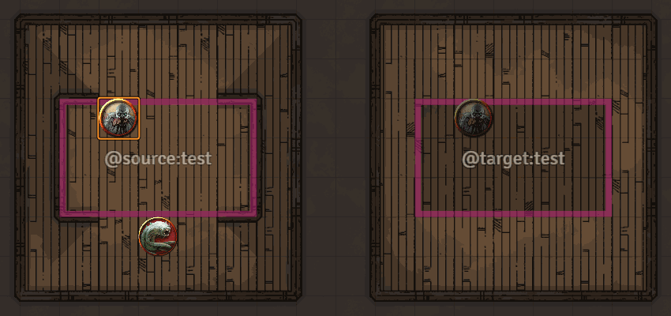
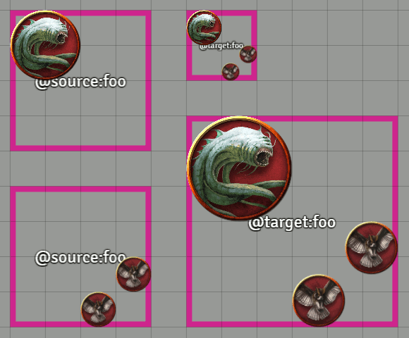
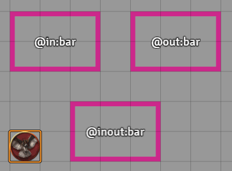

# Multilevel Tokens module for Foundry VTT

This module for FoundryVTT adds features to help support multi-level or multi-floor maps, particularly those where each floor is a separate scene or a separate part of the map.

After marking out _source_ and _target_ regions, any tokens present in each source region will be automatically cloned to the corresponding target region. Cloned tokens will be kept up-to-date with the original tokens, mirroring their relative movement and other updates to the originals.

For example, if a source region is a part of a lower floor, and its target region is the corresponding empty space on the upper floor beside a balcony of some sort, players can "see" what's happening on the floor below.

You could probably also use this functionality for other interesting things, like crystal balls, or who knows.

As a bonus, since multi-level maps often need a way to travel between the floors, this module also supports simple teleports using a similar mechanism.

# Installation

You can install this module using the following public URL: `https://raw.githubusercontent.com/grandseiken/foundryvtt-multilevel-tokens/master/module.json`

Remember to enable the module in `Manage Modules` menu after installation.

# Usage guide

## Creating cloned regions

1. Use the rectangle, ellipse or polygon drawing tool to create your source and target regions. You probably want to set them to hidden so that your players can't see them.
2. Set the text labels on the drawings (accessible via double right-click menu) to _exactly_ `@source:XXX` and `@target:XXX`, respectively, where `XXX` is some common identifier.
3. That's it! Tokens in the source region will be mirrored in target regions with the matching identifier.

### Notes

* You can have more than one target region with the same identifier: tokens in the source region(s) get mirrored to all of them.
* You can have more than one source region with the same identifier: tokens from all of them get mirrored to the targets.
* Source and target regions can be on the same scene or different.
* You can use the polygon tool to make region with more complicated shapes. You can move and rotate them freely without messing anything up.
* If the source and target regions are different sizes, the mirrored copies will get scaled up or down to fit. You probably want the aspect ratios to match though. It's best to start by making two copies of the same drawing.

* If you want bidirectional syncing of tokens, you need to create two pairs of linked regions with different identifiers (both a source and a target in each place).
* Cloned tokens can't be moved or deleted independently. They don't have a linked actor, aren't controlled by a player, and don't have vision. They have an extra tint applied to make them easily distinguishable, which can be changed in the `Module Settings` menu. They inherit most other properties (hidden, size, name, disposition, etc) from the original token.
* By default, when a player targets or detargets a token, they will also target or detarget any clones or originals of that token. You can turn this off in the `Module Settings` menu if it interferes with anything. Similarly, adding a cloned token to combat will add the original copy to combat instead, as long as it's on the same scene.
* Chat bubbles (if enabled) will be shown on each copy of a token. This can be turned off in the `Module Settings` menu.

## Creating teleports

Teleports work with marked regions just like the cloning system. The only difference is you need to label drawings with `@in:XXX` for a teleport starting area, `@out:XXX` for a destination area, or `@inout:XXX` for a two-way area.

Any token that moves into an `@in` or `@inout` region will be moved to the corresponding
`@out` or `@inout` region. If there's more than one such destination region, one will be chosen randomly. The destination can be on a different scene. (Non-GM owners of the token will get pulled to the new scene if the token teleports to a different one.)

In the `Module Settings` menu you can choose whether a teleport to the same scene will animate the token or move it instantly to the destination.

## Advanced options

* Region identifiers that start with `!` are _scene-local_: they will only match with other regions on the same scene. For example, a region with the label `@in:!bar` will only teleport to a region labeled `@out:!bar` on the same scene, even if another scene also has a region labelled `@out:!bar`. The same behaviour applies to cloned regions. This might be useful if you don't need cross-scene linking, and don't want to worry about making sure you use different identifiers on each scene. Or if you're going to duplicate a scene a whole bunch.

## Troubleshooting

* Drawings need to have been _created_ by a user with the `GAMEMASTER` role in order to function as linked regions.
* For small regions, you may need to reduce the label font size to allow resizing the drawing. Or, you can add the label after the size is right.
* The module needs a Gamemaster logged in to function properly, since it works by tracking changes on the GM's client and issuing commands with GM permissions in the background to manipulate tokens. If tokens get out of sync because of this, you can use the snippet `game.multilevel.refreshAll()` (e.g. from a script macro) to wipe and recreate all cloned tokens.
* Note the above point means performance impact should be low, because all the complicated logic runs only on the GM's client. Other clients only have to deal with the resulting automated token updates.
* If something still isn't working you can file an issue here or reach me at `grand#5298` on the discord.

# Version history

* **0.3.0**:
  * Added a module setting to animate token movement when teleporting to the scene same, default off.
  * Added a module setting to also show chat bubbles on each copy of a token, default on.
  * Added a module setting to synchronize player targeting between original and cloned tokens, default on.
  * Toggling the combat state of a cloned token will now toggle the combat state of its original instead, if on the same scene.
  * Editing a cloned token via the token HUD or configuration menu will now apply the changes to the original token, rather than silently discarding the update.
  * Region identifiers that start with `!` are now scene-local and won't match with regions on other scenes.
  * Fixed compatibility issue with missing actor ID on cloned tokens, affecting at least the Token Mold module.
  * Fixed that tokens deleted by the module weren't removed from combat.
* **0.2.0**:
  * Added support for ellipse and polygon regions.
  * Rotation of drawings is now taken into account.
  * Cloned regions now update when a scene is created or deleted.
  * Fixed incorrect behaviour that could occur when a scene was duplicated.
  * Fixed that a cloned token could be copy-pasted, resulting in a temporary stuck token.
  * Fixed an error that could occur when a rectangle had no `text` property.
* **0.1.0**:
  * First version.
